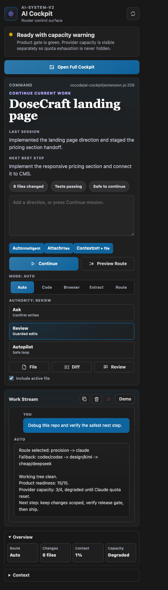

# AI Coding Operating System

This repo is the local control plane for a multi-model AI coding system: a VS
Code cockpit, deterministic router, model/tool lanes, health gates, permission
surfaces, browser proof, and rebuildable macOS dotfiles.

The product promise is simple: developers should not need to decide which AI
tool to use first. They work from one cockpit; the system routes by capability,
cost, trust boundary, and verification needs.

## Why This Exists

Single-model IDE assistants are useful, but they collapse too many jobs into
one lane. This system separates responsibilities:

| Lane | Role |
|---|---|
| Codex | Engineering execution, code edits, local verification |
| Claude | Architecture, hard debugging, security/compliance review |
| Kimi | Browser, UI, screenshots, visual/operator work |
| DeepSeek | Cheap extraction, transforms, summaries, bulk passes |
| ChatGPT image | Image generation/editing |
| TEL | Credentialed actions with audit boundaries |
| Playwright | Clean browser fallback and smoke tests |

The result is not another chat wrapper. It is an AI coding operating system:
cockpit, router, receipts, permissions, memory, browser proof, and packaging.

## Current Product Status

- Internal system: strong and actively usable.
- Public product: in a four-week hardening cycle.
- Master plan: `docs/FOUR-WEEK-PRODUCT-MASTER-PLAN.md`
- Done-state: `.ai/ISA-sellable-open-source-ai-coding-system.md`
- Product contract: `docs/PRODUCT-PACKAGING.md`
- Architecture map: `docs/ARCHITECTURE.md`
- Evaluator quickstart: `docs/EVALUATOR-QUICKSTART.md`
- Contribution guide: `CONTRIBUTING.md`
- Portable CI: `docs/CI.md`
- Security policy: `SECURITY.md`
- License: `LICENSE`
- License/support boundary: `docs/LICENSE-SUPPORT.md`
- Known limitations: `docs/KNOWN-LIMITATIONS.md`
- Roadmap: `docs/ROADMAP.md`
- Release checklist: `docs/RELEASE-CHECKLIST.md`
- Release notes: `docs/RELEASE-NOTES-v0.1.0-rc5.md`
- Release manifest: `docs/RELEASE-MANIFEST-v0.1.0-rc5.md`
- Fresh-clone verification: `docs/FRESH-CLONE-VERIFY.md`
- Browser automation boundaries: `docs/BROWSER-AUTOMATION-TRUTH-TABLE.md`
- Five-minute demo transcript: `docs/FIVE-MINUTE-DEMO-TRANSCRIPT.md`
- Cockpit screenshot plan: `docs/COCKPIT-SCREENSHOT-PLAN.md`

## Quick Proof

```sh
cc-evaluator-check
cc-release-check
cc-public-ci-check
cc-product-readiness
cc-demo-five-minute
cc-demo-fixture
cc-system-demo
cc-workflow-proof
cc-browser-proof --url https://example.com --max-chars 1200
```

Expected mature state: readiness is green, system demo passes, fixture demo
runs against a harmless public repo, workflow proof shows route/readiness/repo
map/diff context, and browser proof returns bounded page content.

## Cockpit Preview



More launch media lives in `docs/media/cockpit/` and is regenerated with
`cc-cockpit-capture`.

## Local Install

Current install is optimized for macOS Apple Silicon while the public packaging
is being hardened.

```sh
git clone git@github.com:Z5Jonathan-maker/dotfiles.git ~/dotfiles
~/dotfiles/install.sh --dry-run
~/dotfiles/install.sh
brew bundle install --file=~/dotfiles/Brewfile
~/dotfiles/install.sh
```

`install.sh --dry-run` is non-mutating. It reports required tools, optional AI
lanes, personal-machine services, planned symlinks, Brewfile drift, and VS Code
extension drift.

## Repository Contents

macOS dotfiles and AI-system config are symlinked into `$HOME` via
`install.sh`.

## What's tracked

| Source (in repo)              | Symlinked to                  |
| ----------------------------- | ----------------------------- |
| `zshrc`                       | `~/.zshrc`                    |
| `zprofile`                    | `~/.zprofile`                 |
| `gitconfig`                   | `~/.gitconfig`                |
| `gitignore_global`            | `~/.gitignore_global`         |
| `tmux.conf`                   | `~/.tmux.conf`                |
| `ssh_config`                  | `~/.ssh/config`               |
| `editorconfig`                | `~/.editorconfig`             |
| `starship.toml`               | `~/.config/starship.toml`     |
| `ghostty_config`              | `~/.config/ghostty/config`    |
| `atuin/config.toml`           | `~/.config/atuin/config.toml` |
| `git-config/allowed_signers`  | `~/.config/git/allowed_signers` |
| `hammerspoon/init.lua`        | `~/.hammerspoon/init.lua`     |
| `claude/CLAUDE.md`            | `~/.claude/CLAUDE.md`         |
| `claude/settings.json`        | `~/.claude/settings.json`     |
| `codex/AGENTS.md`             | `~/.Codex/AGENTS.md`          |
| `vscode/settings.json`        | `~/Library/Application Support/Code/User/settings.json` |
| `vscode/keybindings.json`     | `~/Library/Application Support/Code/User/keybindings.json` |
| `vscode/tasks.json`           | `~/Library/Application Support/Code/User/tasks.json` |
| `vscode/mcp.json`             | `~/Library/Application Support/Code/User/mcp.json` |
| `vscode/ai-cockpit/`          | `~/.vscode/extensions/z5jonathan.ai-system-cockpit-0.1.0` |
| `Brewfile`                    | (run `brew bundle install` against it) |
| `npm-global-packages.txt`     | Small set of npm-only global CLIs restored by `install.sh` |
| `vscode/extensions.txt`       | VS Code extensions restored by `install.sh` |

## Usage

```sh
# Fresh Mac
git clone git@github.com:Z5Jonathan-maker/dotfiles.git ~/dotfiles
~/dotfiles/install.sh
brew bundle install --file=~/dotfiles/Brewfile   # restore brew packages
~/dotfiles/install.sh                            # restore links + npm globals
```

`install.sh` is idempotent — re-running won't clobber existing symlinks, and backs up unrelated files before replacing them.

VS Code is dotfile-managed too: User settings, keybindings, tasks, MCP
config, native AI cockpit extension, and the extension manifest all live under `vscode/`. Run
`~/dotfiles/install.sh` after changing that directory so the live editor
matches the repo.

The global operating doctrine lives at
`docs/PROPRIETARY-SYSTEM-DOCTRINE.md`. It is the compact source for router,
interface, autonomy, token, memory, and credential rules.

The routing architecture study lives at `docs/ROUTER-WIRING-STUDY.md`.
The executable lane contract lives in `ai-lanes.json` and is checked by
`cc-lane-registry-check`.
Video-derived reference notes live at
`docs/VIDEO-REFERENCE-STUDY-2026-05-20.md`.
The product packaging contract lives at `docs/PRODUCT-PACKAGING.md`.
The four-week open-source/product launch plan lives at
`docs/FOUR-WEEK-PRODUCT-MASTER-PLAN.md`.
Browser automation boundaries live at
`docs/BROWSER-AUTOMATION-TRUTH-TABLE.md`.
Disk readiness notes live at `docs/DISK-READINESS-AUDIT-2026-05-21.md`.
VS Code cockpit notes live at `docs/VS-CODE-COCKPIT.md`.
Cursor reference notes live at `docs/CURSOR-REFERENCE-STUDY-2026-05-21.md`.
Cline reference notes live at `docs/CLINE-REFERENCE-STUDY-2026-05-21.md`.
The cockpit now exposes Cline/Cursor-inspired control surfaces through
`cc-permission-matrix`, `cc-checkpoints`, and `cc-router-receipt`.

## Helper scripts (`bin/`)

These are added to PATH via `zshrc`.

- **`sync-dotfiles [msg]`** — stage + commit + push dotfiles in one call.
- **`gh-auto-auth [scopes]`** — hands-off GitHub re-auth. Uses GitHub's device-code API and drives Chromium via Playwright to type the code and click Authorize. With a logged-in Playwright profile + 1Password browser extension, no human input needed.
- **`gh-playwright-login`** — one-time setup for the above. Opens Chromium with a persistent profile so you can log into GitHub once (1Password handles the password + 2FA TOTP). After that, `gh-auto-auth` is fully autonomous.

## Hands-off `gh` re-auth setup (one-time)

```sh
# 1. Open Chromium with persistent profile and log into GitHub
gh-playwright-login

# 2. After this, future re-auths are autonomous:
gh-auto-auth
```

## What's intentionally NOT tracked

- `~/.zsh_history` — machine-local (use atuin's sync if you want it portable)
- `~/.fzf.zsh` — generated by fzf installer
- `~/.claude/settings.local.json` — machine-local Claude overrides
- `~/.ssh/id_ed25519{,.pub}` — generate per machine; register via `gh ssh-key add`
- Secrets of any kind. If a credential is here by accident, rotate it.
