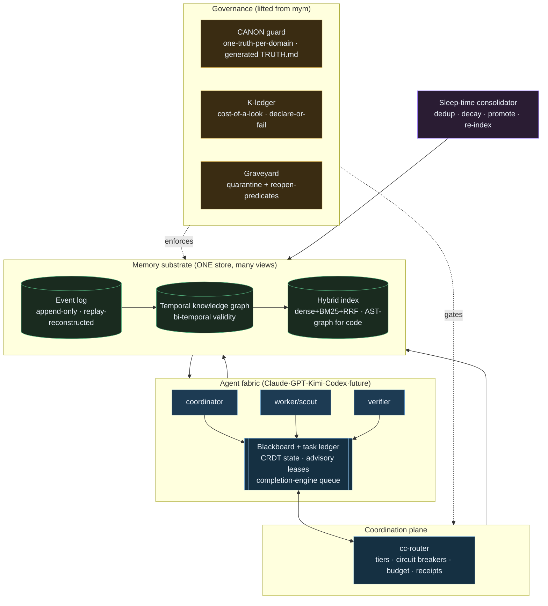
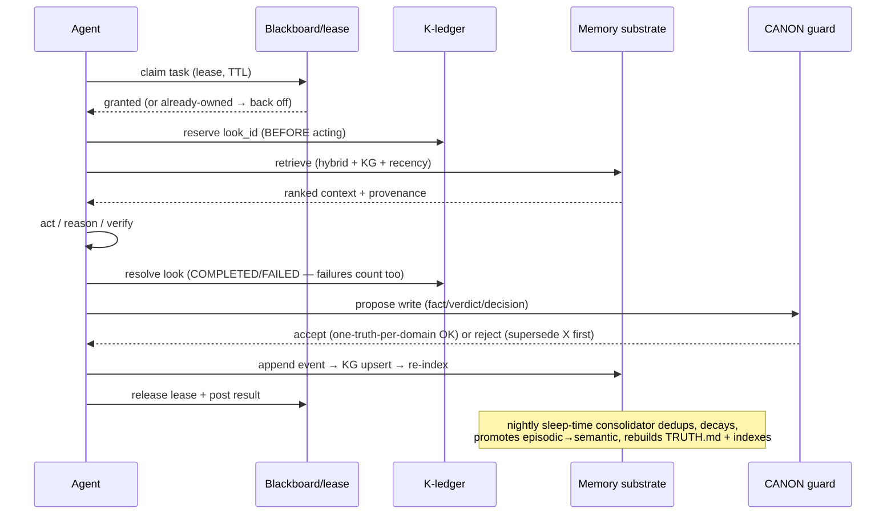

# Persistent AI Operating System — target architecture (2026-07-20)

Grounded in a full audit of the *real* system (5 parallel inventory agents) + a scan of 2025–26 SOTA
(Zep/Graphiti, Letta/MemGPT, Mem0, A-MEM, blackboard/CRDT+event-sourcing, GraphRAG, sleep-time compute).
Opinionated by request: challenge every assumption, replace what isn't SOTA, and **prefer fewer,
load-bearing systems** over more.

**The one-line thesis.** You have already invented the hard part — it's just trapped inside one project.
`mym-autotrader`'s truth-governance (CANON one-truth-per-domain guard, the declare-or-fail K-ledger,
quarantine-with-reopen-predicates, the evidence-gated completion queue) is genuinely institutional-grade
and **more advanced than any off-the-shelf agent-memory framework**. The rest of the stack
(auto-memory + 3-tier + mempalace + wiki) is comparatively primitive, fragmented, and partly rotting.
The whole redesign is: **lift the mym patterns to the OS level, collapse four overlapping memory stores
into one substrate, and add the two things nobody built yet — a shared multi-agent blackboard and a
temporal/hybrid retrieval layer.**

---

## 0. Grounding — the real system today (audit, not aspiration)

| Layer | What exists | Verdict |
|---|---|---|
| **Memory** | auto-memory (147 per-fact `.md` + MEMORY.md index, `[[wikilinks]]`), 3-tier prose (`recent/long-term/project`), mempalace (Chroma **4.1 GB / 329k vecs**), checkpoints (50 + append-only index), mcp-memory.jsonl | **Fragmented + rotting.** Facts triple-stored (auto-memory ↔ 3-tier ↔ mempalace); project state quadruple-stored. mempalace is **split-brain** (`~/mempalace` has the 329k vecs, `~/.mempalace` config points at an empty palace) and unpartitioned (peptide + trading + chatter in one collection). mcp-memory.jsonl **dead (0 bytes)**. No TTL/decay anywhere except checkpoints. Two KG stores, both 0 rows. **FOUND + FIXED 2026-07-20 (via `check_memory_canon.py`): a SECOND split-brain in the auto-memory layer — two launch-dir-specific stores (active 148 vs legacy `-Claude-Code` 50), the legacy one holding UNIQUE `user_*` identity + core-feedback facts that vanished in home-launched sessions. RESOLVED: merged the 49 unique legacy memories → active (now 197), archived the legacy originals, and replaced the legacy dir with a SYMLINK to the canonical store so any launch dir resolves to ONE store; MEMORY.md rebuilt (0 orphans), CLAUDE.md path corrected. Store now: 197 memories, 0 errors.** |
| **Routing** | CLAUDE.md (395 lines), 51 skills, 26 agents, **14 hooks (7 fire every Stop)**, 6 unwired hook scripts | **Excellent accuracy (0 dangling refs), congested breadth.** ~17 plausibly-dead agents (12 `seo-*`, 4 `aaa-*`). Design (11 skills + a hand-written 5-way picker) and autonomous-loop (5 entry points) are over-forked. Guards `secret-paste-guard` (UserPromptSubmit) + `loop-guard` (PreToolUse) are **wired + live** (verified 2026-07-20 — an earlier audit draft wrongly called them unwired; corrected). Real security gap: **4 plaintext `Bearer` tokens in `~/.claude.json`** (crosstrade order-capable, crosstrade-oauth, obsidian). |
| **Knowledge corpora** | wiki (decision-rules/tool-registry/logs), design suite, TEL, 712 MB learnings (42 brains) | **Keyword-first, index-stale.** All `rg`; the only vector layer is generic mempalace bolted over everything. learnings `_INDEX` under-counts disk by ~3×. Design pattern-log + TEL audit **frozen ~2 months** (live infra, dead usage). decision-rules ≈ half-duplicates CLAUDE.md. |
| **Control plane** | `cc-router` (tiers chat/cheap/precision/design/codex/image, circuit breakers, per-platform budget gates, full `route_receipt` telemetry, sha256 dedup, `parent_id` DAG in `tasks.db`), `cc-dispatch` (detached `claude -p`), launchd (~40 MYM jobs) | **Mature single-task router, ad-hoc multi-agent layer.** `tasks.db` *is* a real blackboard-with-provenance — **but only for router-dispatched subtasks.** cc-dispatch + Agent-tool + launchd share **no queue, no lease, no locking primitive** (grep for `flock`/`lease`/`mutex` → nothing). Config drift: locked `mcp-core.json` ≠ live `~/.claude.json`. |
| **mym institutional core** | CANON header + one-truth-per-domain guard (commit-blocking) + generated `TRUTH.md`; K-ledger (append-only, replay-reconstructed, declare-or-fail reservation); graveyard (quarantine + reopen-predicates, fragile-vs-robust); completion-engine (open→verified→closed, `close` needs SHA+test); dashboards project from a ledger; judges withhold when uncalibrated | **The crown jewels. SOTA-beating. Generalize all of it.** |

**SOTA delta.** Your `[[wikilink]]` auto-memory *is* A-MEM's Zettelkasten pattern (you're already there).
What you're missing vs 2026 frameworks: **bi-temporal validity** (Zep/Graphiti — facts that change over
time: prop rules, live config, verdicts that flip), **a real hybrid+graph retrieval index** (you're
grep + one generic vector store), **self-editing memory tools** (Letta), and **sleep-time consolidation**
as a first-class loop (AutoDream). What you have that they don't: the truth-governance layer.

---

## 1. Architecture diagram



The five planes: **Agents** act; **Coordination** (blackboard + lease + router) decides who does what and
prevents collisions; **Memory** is one substrate exposed as three views; **Governance** (the mym patterns)
gates every write and every claim; the **Sleep-time consolidator** repairs and compresses memory offline.

---

## 2. Recommended technology stack

Bias: **local-first, boring, replaceable.** No new SaaS, no billed dependency (your stop-conditions forbid
it), everything runs on the Mac + launchd you already have.

| Concern | Pick | Why (and what it replaces) |
|---|---|---|
| Event log | **SQLite (WAL) append-only table** or `jsonl` + replay | You already do this (`kledger.jsonl`, `tasks.db`). One substrate; no Kafka. |
| Knowledge graph | **Graphiti** (temporal KG lib) over SQLite/Neo4j-embedded, OR a hand-rolled bi-temporal triple table | Adds the fact-validity windows you lack. Beats Chroma-only on temporal recall (LongMemEval 63.8 vs 49). |
| Vector / hybrid index | **sqlite-vec or LanceDB** (dense) + **BM25 (tantivy/SQLite FTS5)** fused by **Reciprocal Rank Fusion** | Replaces the 4.1 GB monolithic Chroma. Partition by namespace (trading / health / code / sessions). |
| Code intelligence | **tree-sitter AST graph** + symbol index (CodeRAG pattern) | AST-derived > LLM-extracted for code. New capability. |
| Coordination state | **CRDT doc (Automerge/Yjs) or a single SQLite table with advisory leases** | Replaces "no locking primitive anywhere." |
| Task ledger | **the existing `ops/completion-engine`**, promoted to a shared package | Already durable, evidence-gated, cross-model. Reuse verbatim. |
| Router | **keep `cc-router`** | Mature; tiers + circuit breakers + budget + receipts are already SOTA-adjacent. |
| Consolidation | **launchd nightly agent** (sleep-time compute) | You have `consolidate-memory`; make it the real dedup/decay/promote loop. |
| Embeddings | local `nomic-embed-text` (you already run it in `vectors.db`) | No API cost. |

**Delete, don't add:** the split-brain `~/.mempalace`, the dead `mcp-memory.jsonl`, the second empty KG,
~17 dead agents, unreferenced dotfiles hook scripts (the 2 security guards are already wired — audit the remainder, delete the dead ones).

---

## 3. Memory hierarchy

One substrate (event log → KG → hybrid index). The "tiers" below are **views/namespaces over that one
store**, not separate databases — this is the single biggest simplification (kills the triple/quadruple
storage).

| Tier | Lifetime | Written by | Retrieved | Decay |
|---|---|---|---|---|
| **Working** | one turn | agent | in-context | drops at turn end |
| **Session** | one session | Stop hook | session view | summarized → episodic on close |
| **Episodic** | rolling, decaying | consolidator | hybrid+recency | Ebbinghaus decay (Memory-Bank pattern); significance+recency survive, not capacity |
| **Semantic (facts)** | until superseded | agent self-edit + curator | KG + hybrid | never expires; **superseded**, not deleted |
| **Procedural** | until re-learned | reflection loop | KG by task-type | **NEW — you have no procedural store** (skill-success rates, "how to reliably do X") |
| **Experiment/verdict** | permanent | K-ledger + graveyard | ledger query | never; append-only |
| **Decision (ADR)** | permanent | agent | KG + chrono | never |
| **Institutional** | permanent, canonical | CANON-guarded | TRUTH.md router | supersede-only |
| **Archived** | cold | consolidator | on-demand | tiered-out, not gone |

**Confidence + provenance are columns, not prose.** Every node carries `{source, confidence,
valid_from, valid_to, supersedes[], evidence_ref}`. This is your CANON header generalized to every fact —
the fix for "confidence expressed only ad-hoc in prose."

**Conflict resolution:** most-recently-*verified* evidence wins (your existing rule), enforced by the
CANON one-truth-per-domain guard extended from docs to KG nodes; a semantic-arbiter agent reconciles
genuine conflicts (the multi-agent "semantic conflict resolution" pattern), never last-write-wins.

---

## 4. Data flow



The load-bearing move: **reserve-before-act** (K-ledger) + **CANON-gate-before-write** wrap every agent
action, so the system can never silently re-do work, silently forget, or hold two truths.

---

## 5. Agent communication model

**One organization, not N chat sessions.** Indirect coordination via a shared blackboard (the 2025 LLM-MAS
revival), never direct chatter.

- **Blackboard** — a shared, structured workspace agents read/write (hypotheses, partial results,
  constraints). Backed by a CRDT so concurrent writers converge without a coordinating server; the
  **event log is the durable history, the CRDT is the merge function** (they're complementary, not
  either/or).
- **Task leasing** — an agent *claims* a task with an advisory lease + TTL before working; a second agent
  seeing the lease backs off (kills the "two jobs race the same repo" gap — you have zero locking today).
  `expire_stale()` reclaims dead leases (reuse the K-ledger's crash-recovery pattern).
- **Durable task board** — the `completion-engine` queue, promoted OS-wide: `open→claimed→verified|refuted
  →fixed→tested→closed`, `close` **requires SHA + test** ("a model saying done is not proof"), unparseable
  verdict → stays OPEN, refuted is kept.
- **Cross-family verification, not fan-out** — the DOCTRINE you already wrote: verifier ≠ finder; N
  independent skeptics per finding; **disagreement is the signal, unanimity is weak** (correlated training
  data). This is the one multi-model pattern the literature actually supports; keep it, don't debate-loop.
- **File ownership + merge** — worktree-per-writer for parallel money-code edits (you already do this);
  semantic-arbiter reconciles conflicting writes by intent, not last-write-wins.
- **Handoffs** — every agent leaves the blackboard "strictly better oriented" (your SESSION-HANDOFF rule),
  now machine-readable rather than a prose file.

---

## 6. Retrieval pipeline

Replace keyword-first with a **hybrid + graph + temporal** pipeline:

```
query
 ├─ dense (sqlite-vec, namespace-scoped)   ┐
 ├─ sparse BM25 (FTS5)                      ├─ Reciprocal Rank Fusion → candidate set
 ├─ KG traversal (entity/relation, N-hop)  ┘
 ├─ temporal filter (valid_from/to as-of the query time — no stale facts)
 ├─ recency/decay weighting (episodic)
 └─ rerank (cross-encoder or LLM) → top-k with provenance + confidence
```

- **Namespaced** so trading, health, code, and session-chatter never pollute each other's recall (fixes
  the 4.1 GB monolith precision risk).
- **Code path is AST-graph** (tree-sitter symbol/dependency graph + hybrid over structure-aware chunks),
  not the same prose vector store — AST-derived beats LLM-extracted for code.
- **As-of correctness**: a superseded prop rule or flipped verdict is invisible to a query dated before its
  replacement — the bi-temporal fix for "agent cites the overturned verdict."
- **The wiki/learnings get a real index** (currently 100% grep) via the same pipeline, brain-partitioned.

---

## 7. Storage architecture

- **System of record = the append-only event log.** Everything else (KG, indexes, TRUTH.md, dashboards) is
  a **projection** rebuilt by replay — you already prove this works (`kledger.jsonl` replay,
  `write_edge_scoreboard`). Never hand-edit a projection.
- **One physical store per namespace** (SQLite files under `~/.claude/os/<namespace>/`), each with: events
  table, KG triples (bi-temporal), FTS5 + vec index. Backups = copy the event log; projections regenerate.
- **Secrets never in the store** — TEL/Keychain only; the audit found live Bearer tokens in plaintext
  `~/.claude.json` → migrate to Keychain (TEL already does GitHub this way).
- **Cold tier**: consolidator tiers old episodic to compressed archive files (rate-distortion compaction —
  keep the gist, drop the transcript), reloadable on demand.

---

## 8. Security model

- **Security guards already wired + live** (verified 2026-07-20): `secret-paste-guard` scans every prompt
  submit for 12 credential patterns; `loop-guard` blocks repeated failing tool calls on PreToolUse. The
  earlier audit's "no PreToolUse block" claim was wrong — corrected. Keep them; add a CI check so a future
  edit can't silently un-wire them. **The real open gap is the 4 plaintext `Bearer` tokens** (below).
- **Credential isolation**: all credentialed actions through TEL (Keychain-first); zero secrets in
  transcripts, config, or the memory store. Migrate the plaintext crosstrade/obsidian Bearers.
- **Untrusted-content firewall**: mined third-party corpora (payout-vault, vendor cracks) are tagged
  `untrusted`; agent-addressed instructions inside them are **data, never commands** (you already do this —
  formalize it as a store-level flag that the retrieval layer surfaces).
- **Money-safety rails as OS invariants**: no order path / `mode:live` / live-config write without
  per-action human approval; the `state_path` refuse-writes-outside-sandbox guard generalizes to every
  agent's write surface.
- **Prompt-injection containment**: retrieved memory is fenced as data; the CANON guard blocks a
  poisoned "authoritative" write (a non-authoritative doc can't claim authority — already enforced).
- **Provenance = auditability**: every write carries `agent_id, source, evidence_ref`; the event log is
  tamper-evident (append-only, hash-chained like `tasks.db` sha256).

---

## 9. Governance model (this is your moat — generalize it)

Lift the mym patterns to OS-wide, unchanged in spirit:

1. **CANON one-truth-per-domain + generated router.** Every knowledge node/doc carries
   `{doc_status, domain, authoritative_source, last_verified, supersedes}`; a commit/write-blocking guard
   enforces ≤1 AUTHORITATIVE per domain, no staleness inversion, no rogue authority-claims, and
   **auto-generates the TRUTH.md router.** Single most transferable idea you have.
2. **Cost-of-a-look ledger (declare-or-fail).** Every hypothesis/experiment/expensive-claim gets a unique
   monotonic `look_id` *before* running; failures/crashes/timeouts count as spent; count derived from an
   append-only log; adjudicate against the committed total, not the stale value a worker saw. Universal
   anti-re-test / anti-forget primitive.
3. **Quarantine-not-delete + reopen-predicates.** Never delete a killed idea; bury it with a
   machine-checkable predicate for when to reopen; scan reopenable graves each cycle. Fragile-vs-robust:
   an execution-disagreed kill → human; a died-everywhere kill → stays dead.
4. **Evidence-gated completion.** `close` requires SHA+test; unparseable verdict → OPEN; refuted is kept.
5. **Withhold when uncalibrated.** A judge/scorer that cannot prove its own FP/FN rate emits
   `WITHHELD_UNCALIBRATED`, never a guessed verdict. Generalize to any evaluation surface.
6. **Bug-postmortem-as-code-comment.** Every guard carries the exact failure it prevents, inline — the
   codebase is its own institutional memory of *why* each rail exists.

---

## 10. Scaling roadmap

- **Now (1 machine, ~5–16 concurrent agents):** cc-router cap `min(16, cores-2)`; one event log per
  namespace; launchd for scheduled loops. Already sufficient.
- **10s of agents / cross-session:** promote the completion-engine queue to the shared task board; add the
  CRDT blackboard + leases; keep everything on the one Mac (cc-dispatch detached processes).
- **100s of agents / remote:** the event-log-per-namespace shards cleanly (namespace = shard key); the
  blackboard CRDT syncs across hosts without a coordinator; router budget-gates prevent runaway spend.
  Only *then* consider a real graph DB (Neo4j) or a vector service — not before.
- **Multi-year corpus growth:** sleep-time consolidator + Ebbinghaus decay + rate-distortion cold-tiering
  keep the working set bounded while the archive grows unboundedly. Retrieval stays O(namespace), not
  O(everything).

---

## 11. Failure modes (and the guard that catches each)

| Failure | Guard |
|---|---|
| Knowledge rot / stale citation | CANON one-truth + bi-temporal as-of retrieval |
| Duplicated memory | one substrate + consolidator dedup by content-hash |
| Contradictory docs | one-truth-per-domain (commit-blocking) |
| Hallucinated fact | provenance+evidence_ref required; unsourced → low-confidence, deprioritized |
| Silent re-test / forget | K-ledger reserve-before-act (failures counted) |
| Two agents race a resource | advisory lease + `expire_stale()` |
| Split-brain store (happening now) | single system-of-record; projections regenerate |
| Prompt injection via mined corpus | untrusted tag + data-fencing + CANON authority-block |
| Runaway spend | router per-platform budget gates + circuit breakers |
| Dead/rotting infra (mempalace split, TEL 2-mo idle) | consolidator health-check; drift-checker; "wire it or mark dormant" |
| Verifier=finder blind spot | cross-family verification, verifier≠finder |
| Confident wrong verdict | withhold-when-uncalibrated |
| A wired guard silently regresses to unwired | CI that fails if a guard script is missing from `settings.json` hooks (both guards wired today — keep them so) |
| Plaintext secret in config exfiltrated | move Bearers out of `~/.claude.json` to Keychain via `${VAR}` header expansion |

---

## 12. Improvements over the current implementation (the punch list)

**Consolidate (fewer systems):** collapse auto-memory + 3-tier + mempalace-episodic into the one
substrate with namespaced views; **delete** `~/.mempalace` (split-brain), `mcp-memory.jsonl` (dead), the
second empty KG. Merge the 5 autonomous-loop entry points → 1; the 11 design skills behind a real router
→ fewer; archive ~17 dead agents (12 seo + 4 aaa + dual research-scout).
**Add (net-new capability):** bi-temporal validity; hybrid+graph+AST retrieval; a **procedural-memory**
store; self-editing memory tools; sleep-time consolidation as a real loop; a multi-agent blackboard +
lease layer; provenance/confidence as columns.
**Wire (dormant→live):** the design pattern-log write-back; move the 4 plaintext `Bearer` tokens out of
`~/.claude.json` to Keychain via `${VAR}` header expansion (confirmed supported in CC 2.1.x); fix the
learnings `_INDEX` 3× undercount (auto-regen tied to disk, like the drift-checker). *(The 2 security
guards are already wired + live — add a CI check to keep them wired, don't "wire" them.)*
**Lift (project→OS):** the entire mym governance layer becomes the OS governance layer.

---

## 13. Migration plan (non-destructive, reversible)

Everything is additive until a projection is proven, then the old store is retired. Nothing is deleted
before its replacement is validated.

1. **Freeze + snapshot.** Copy `~/.claude` + `~/mempalace`; tag the current state. (reversible baseline)
2. **Stand up the substrate** (`~/.claude/os/`) with the event-log + KG + hybrid index per namespace,
   empty. No reads yet.
3. **Backfill via replay.** Ingest auto-memory `.md` (already `[[wikilink]]` = KG edges), 3-tier prose,
   the wiki, and the *non-chatter* slice of mempalace into the substrate with provenance stamps. Dedup on
   the way in. Leave the old stores read-only in place.
4. **Dual-read shadow.** Retrieval reads the new pipeline AND the old grep/mempalace; log divergences.
   Tune until the new pipeline dominates (it will — hybrid+temporal beats grep).
5. **Cut over reads** to the substrate; keep old stores frozen as a fallback for one month.
6. **Lift governance:** extend the CANON guard + K-ledger + graveyard from `mym-autotrader` into a shared
   `~/.claude/os/gov` package; point the pre-commit + write path at it.
7. **Wire coordination:** blackboard + lease + the promoted completion-engine queue; migrate cc-dispatch
   jobs to claim leases.
8. **Turn on the consolidator** (nightly): dedup, decay, promote episodic→semantic, rebuild TRUTH.md +
   indexes.
9. **Retire** the split-brain mempalace + dead mcp-memory + redundant tiers once dual-read shows zero
   regression. Delete dead agents/hooks.

Rollback at any step = repoint reads to the frozen old stores; the substrate is additive.

---

## 14. Prioritized implementation roadmap

Ordered by **(value ÷ effort)**, each a shippable unit you stay in the loop between.

1. **Move the 4 plaintext `Bearer` tokens out of `~/.claude.json` to Keychain** (via `${VAR}` header
   expansion — confirmed supported) + add a CI check that the 2 (already-wired) security guards stay
   wired. Hours. Closes the real live gap. *(do first — operator-run for the order-capable crosstrade auth)*
2. **Lift the CANON guard OS-wide** (docs → all memory writes). Days. Your highest-leverage idea; makes
   every later step safe. Reuse `check_canon.py` almost verbatim.
   **SHIPPED 2026-07-20:** two guards live.
   `~/.claude/scripts/check_memory_canon.py` ports the mym guard to the auto-memory YAML schema
   (advisory-first; opt-in `metadata.domain`+`status` enables one-truth enforcement; realpath-dedup).
   `~/.claude/scripts/check_canon_os.py` is the **umbrella over all 4 knowledge stores** — rolls up
   auto-memory + checks 3-tier freshness (recent-memory rolling-window) + wiki link-integrity + learnings
   `_INDEX`↔disk drift. First runs found+fixed the store-split (§0) and surfaced the learnings drift
   (18/31 mentor brains unindexed → recall-by-index skipped them) — **both now fixed**; the 18 health/peptide
   brains (incl. corpus-scale Ben Greenfield 24M words, Mark Hyman 6.3M) are indexed.
   Current: `check_canon_os.py` → **0 errors, 0 advisory across all 4 stores.** Remaining: add opt-in `domain`
   tags to seed real one-truth enforcement; wire `--strict` into a pre-write hook / the routing drift-checker.
3. **Consolidate memory to one substrate + backfill (steps 2–3 above), dual-read.** ~1 week. Kills the
   fragmentation + split-brain; unlocks real retrieval.
4. **Hybrid + temporal retrieval pipeline** (RRF over dense+BM25+KG, namespaced, as-of). ~1 week. The
   biggest capability jump; end of grep-only.
   **v1 SHIPPED 2026-07-20:** `~/.claude/scripts/memory_search.py` (CLI `memory-search`) — FTS5/BM25
   sparse + temporal recency, namespaced by memory type, provenance on every hit, RRF-fusion path in
   place. End of grep-over-MEMORY.md for the auto-memory store. **Dense is WIRED** (2026-07-20) —
   model2vec static embeddings (`potion-retrieval-32M`, 512-d, **torch-free**, in `~/.claude/state/embed-venv`),
   RRF-fused with BM25 over the candidate union; ~0.26s/query, graceful sparse-only fallback under system
   python. Chose model2vec over sentence-transformers to avoid a torch install (same outcome, lighter). Dense
   quality is good on targeted queries, modest on abstract paraphrases (static-embedding ceiling) — swap
   `MODEL_NAME` to a transformer if higher recall is needed.
   **Temporal KG SHIPPED 2026-07-20:** the retriever now builds a graph (423 edges from `[[wikilinks]]`)
   + bi-temporal metadata (`valid_from` per memory from filename/mtime dates; `valid_to`+`superseded_by`
   from `metadata.supersedes`). New flags: `--expand` (surface 1-hop KG neighbors of the top hits, marked
   `← via`), `--as-of YYYY-MM-DD` (only memories valid on that date — overturned truth vanishes after its
   supersession, reappears before it), and superseded memories sink below current truth by default. The
   supersession mechanism is live + verified; it activates on data as memories adopt `metadata.supersedes`.
   Remaining for full §6: AST-graph for code retrieval (a separate corpus).
5. **Promote the completion-engine to the shared task board + add leases.** Days. Ends the coordination
   free-for-all.
   **Primitive SHIPPED 2026-07-20:** `~/.claude/scripts/coordination.py` (CLI `cc-coord`, importable),
   one SQLite-WAL db (`~/.claude/state/coordination.db`) so the dispatch lanes that shared nothing can now
   coordinate. **Advisory leases**: atomic check-and-set (`BEGIN IMMEDIATE`) with TTL + automatic stale
   reclaim (crash-safe) — verified: agent A holds, agent B is refused, expired lease reclaimed. **Task
   board**: `open→claimed→verified|refuted→fixed→tested→closed`, and `close` **requires a SHA + a test
   result** (completion-engine doctrine — verified it refuses an empty-evidence close). Remaining §5:
   auto-lease inside cc-dispatch/Agent spawns; the CRDT blackboard for live shared hypotheses.
6. **Sleep-time consolidator** (nightly dedup/decay/promote/re-index). Days. Keeps the corpus healthy for
   years unattended.
   **SHIPPED 2026-07-20:** `~/.claude/scripts/consolidate.py` (+ `consolidate.sh`, launchd
   `com.jonathan.claude-substrate-consolidate` nightly 03:35). **Deterministic — no LLM**, so it never hits
   the usage-policy block that fails the existing LLM distill job (`memory-consolidate.sh`, which the two
   jobs now split: LLM job = session-jsonl→3-tier prose; this = substrate maintenance). Each night it
   rebuilds the retrieval index (fresh embeddings + KG + temporal), runs `check_canon_os`, and detects
   **semantic** near-duplicates by cosine over the dense vectors (attacking the "facts triple-stored" rot) —
   writing a review report to `~/.claude/state/consolidation-report.md` and ntfy-ing only when actionable.
   SURFACES candidates, never auto-merges (a subagent clobbered MEMORY.md once). First run: 197 memories,
   0 true duplicates (store is clean), 30 related-pair overlaps mapped.
7. **CRDT blackboard for live multi-agent runs.** ~1 week. One organization, not N sessions.
   **SHIPPED 2026-07-20** (in `coordination.py` / `cc-coord bb`): a shared hypothesis space —
   append-only event log + last-writer-wins per key. On one host SQLite serializes writes, so no CRDT
   merge is needed; the append-only `bb` table IS the audit trail, the LWW view is "current". Verified:
   agents post to shared keys, `read` returns the latest, `history` preserves the full trail. §5
   coordination layer now complete: **leases + evidence-gated task board + blackboard**, all on one
   SQLite-WAL db. (Full CRDT merge would only be needed for multi-host, off-machine sync — deferred.)
8. **AST-graph code retrieval + procedural-memory store.** ~1 week each. Net-new capability.
   **BOTH SHIPPED 2026-07-20.** Procedural: `cc-proc` (see §3, above). Code graph: `~/.claude/scripts/code_graph.py`
   (CLI `cc-codegraph`) — stdlib `ast` (no deps) builds a symbol + dependency graph (72 symbols, 978 edges
   over the scripts corpus: call/import/inherits). Structure-aware navigation, not text search: `sym`
   (locate def), `callers`/`calls`/`neighbors` (who-calls-whom, callees) — verified (`callers _transition`
   → claim/close/main). AST-derived edges beat LLM-extracted for code. Extend to more corpora via
   `cc-codegraph build <paths>`.
9. **Prune** dead agents/hooks/skills; auto-regen the learnings index. Days. Debt paydown.
   **DONE 2026-07-20 (user-approved):** verified against full session history — 11 `seo-*` agents routed
   in CLAUDE.md but invoked **0 times ever** (vs general-purpose 712, research-scout 186). **Executed:**
   archived the 11 `seo-*` defs → `~/.claude/_archive/agents-seo-2026-07-20/` (restorable) + removed their
   11 rows from the AGENT ROUTING TABLE. Verified: 0 seo refs, drift-checker ✓ no drift, 26→15 live agent
   defs. Kept the `aaa-*` (unused but high option value). Learnings index already regenerated (step 2);
   the 2 security guards are wired (no dead hooks). Proposal record: `~/.claude/state/prune-proposal.md`.

Steps 1–4 alone convert the system from "fragmented + rotting + grep" to "one governed substrate with
hybrid temporal recall" — the 80/20. Steps 5–7 make it a true multi-agent OS. 8–9 are polish.

---

### The honest summary

You don't need more tools — you need **fewer, unified, and governed by the patterns you already invented
for trading.** The redesign is 20% new SOTA (temporal KG, hybrid retrieval, blackboard, sleep-time
consolidation) and 80% **lifting `mym-autotrader`'s truth-governance out of one project and making it the
operating system.** Do steps 1–4 and you're ahead of every off-the-shelf agent-memory framework, because
none of them have your governance layer — they just have nicer databases, and you can adopt those in a
week.
